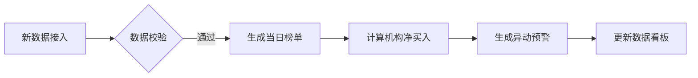
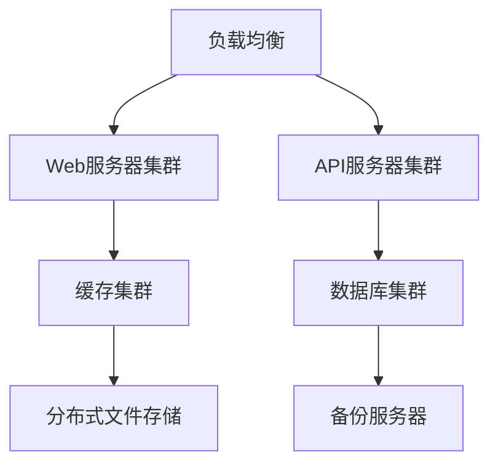

# 龙虎榜信息管理系统功能需求报告

## 一、数据采集子系统
### 1.1 基础采集功能
- **定时爬取**  
  每日16:30自动抓取东方财富网龙虎榜数据（收盘后1小时内完成）
- **数据范围**  
  包含沪深两市主板/创业板/科创板全部上榜股票
- **字段采集**  
  ```python
  {
    "上榜日期": "YYYY-MM-DD",
    "股票代码": "000001.SZ",
    "股票名称": "平安银行",
    "收盘价": 12.34,
    "涨跌幅": "+10.02%",
    "换手率": "15.67%",
    "买卖席位": {
      "买方": [
        {"营业部名称": "中信上海分公司", "买入金额(万)": 12345, "卖出金额(万)": 0},
        ...（前5买方）
      ],
      "卖方": [
        {"营业部名称": "深股通专用", "买入金额(万)": 0, "卖出金额(万)": 23456},
        ...（前5卖方）
      ]
    },
    "上榜原因": "日涨幅偏离值达7%"
  }
  ```

### 1.2 增强功能
- **断点续传**：支持异常中断后从断点恢复采集
- **数据校验**：建立规则引擎验证数据完整性（如买卖金额平衡校验）
- **版本追溯**：保留历史数据版本（支持数据修正回溯）

## 二、数据管理子系统
### 2.1 存储架构
| 数据库类型 | 存储内容                      | 索引设计                  |
|------------|-------------------------------|---------------------------|
| MySQL      | 基础交易数据                  | 复合索引(trade_date+code) |
| MongoDB    | 非结构化数据（营业部操作明细）| 地理空间索引              |
| Redis      | 实时查询缓存                  | TTL自动过期               |

### 2.2 数据维护
- **自动归档**：超过3年的数据转存冷存储
- **增量更新**：基于时间戳的增量更新机制
- **数据清洗**：异常值处理规则库（如金额单位转换）

## 三、核心功能模块
### 3.1 实时榜单分析


### 3.2 智能查询系统
**查询维度**：
1. 基础查询
   - 按股票代码/名称模糊查询
   - 日期范围选择（支持自然语言：近3天/本月）
2. 高级查询
   - 营业部关联查询（查询共同操作记录）
   - 资金规模筛选（净买入＞5000万）
   - 异动类型筛选（连板股/机构对决）

**查询结果展示**：
- 表格视图：支持多列排序
- 矩阵视图：营业部-股票关系矩阵
- 图谱模式：资金流向关系图

## 四、扩展功能体系
### 4.1 智能预警系统
| 预警类型       | 触发条件示例                  | 通知方式         |
|----------------|-------------------------------|------------------|
| 机构异动       | 同一营业部3日内重复上榜       | 微信/邮件        |
| 资金异常       | 买卖金额差异＞30%             | 系统弹窗         |
| 监管风险       | 出现被监管营业部              | 红色预警标识     |

### 4.2 深度分析功能
- **机构画像**  
  生成营业部操作风格分析报告（偏好板块/持股周期）
- **关联分析**  
  识别关联账户集群（通过IP/操作时间/股票重合度）
- **策略回测**  
  提供「龙虎榜策略」历史收益率回测功能

## 五、界面设计要求
### 5.1 数据可视化
- **热力图**：展示地域性资金流动
- **时间轴**：个股上榜历史时间轴
- **桑基图**：资金在机构间的流转路径

### 5.2 交互设计
- **看板定制**：用户可保存个性化看板模板
- **数据对比**：拖拽式多股票对比功能
- **智能导览**：新手引导模式（操作演示）

## 六、系统接口
### 6.1 内部接口
- 数据采集服务API（Restful）
  ```
  POST /api/v1/collect
  {
    "start_date": "2025-02-20",
    "end_date": "2025-02-20",
    "market": "ALL" 
  }
  ```

### 6.2 外部接口
- 东方财富数据接口（模拟登录+页面解析）
- 证监会备案营业部查询接口

## 七、非功能需求
### 7.1 性能指标
| 场景                 | 响应时间 | 并发量 |
|----------------------|----------|--------|
| 单股票查询           | ≤1s      | 1000   |
| 复杂条件查询         | ≤3s      | 200    |
| 全市场数据导出       | ≤5min    | 10     |

### 7.2 安全要求
- 数据加密：传输使用TLS1.3，存储AES256加密
- 访问控制：RBAC权限模型（角色：游客/会员/管理员）
- 审计日志：记录所有数据修改操作

## 八、部署架构


> 系统需满足《证券期货业数据分类分级指引》要求，数据保存周期符合证监会规定
```
