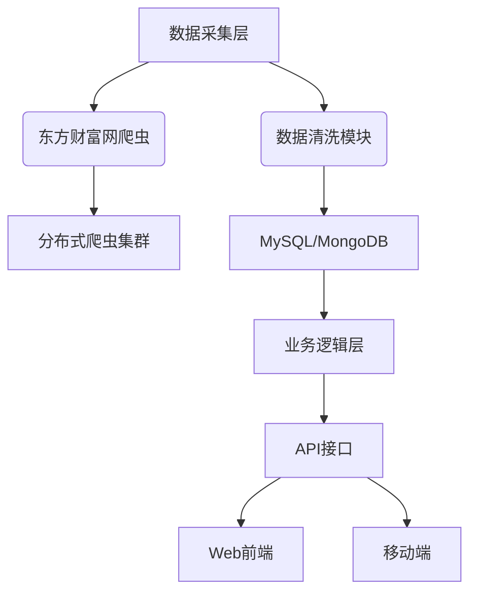

项目需求报告：龙虎榜数据自动化采集与分析系统


一、项目概述
本系统旨在通过自动化采集东方财富网龙虎榜数据，实现龙虎榜信息的集中管理、实时更新和智能查询功能，为投资者提供高效的数据分析工具。


二、系统目标

• 实现每日龙虎榜数据自动化采集与存储。

• 提供多维度数据查询与可视化展示。

• 支持历史数据回溯与分析。

• 建立完整的数据更新与维护机制。


三、功能需求


（一）核心功能模块

 模块名称       	 功能描述                                                                 	
 数据采集       	 每日定时抓取东方财富网龙虎榜数据（包括：股票代码、名称、买卖机构、金额等）	
 今日榜单       	 按日期展示当日上榜股票明细及机构买卖数据                                 	
 综合查询       	 支持按股票代码、上榜日期、营业部名称等多条件组合查询                     	
 数据统计       	 统计机构/营业部上榜次数、买卖金额排行等                                  	
 数据导出       	 支持Excel/CSV格式导出查询结果                                            	


（二）扩展功能

• 异动预警：设置特定条件（如机构净买入超5000万）触发通知。

• 历史对比：展示个股/机构历史上榜记录对比图表。

• 关联分析：识别关联营业部的协同操作行为。

• 数据看板：生成机构活跃度、板块热度等可视化报表。


四、非功能需求


（1）性能要求

• 数据更新延迟≤15分钟

• 查询响应时间<2秒（百万级数据量）


（2）安全要求

• 数据加密存储

• 访问权限分级控制


（3）兼容性

• 支持Chrome/Firefox/Edge等主流浏览器

• 适配移动端显示


五、技术方案





六、数据字段设计

基础数据表结构：


```python
class DragonTigerList:
    stock_code: str       # 股票代码
    stock_name: str       # 股票名称
    trade_date: date      # 上榜日期
    close_price: float    # 当日收盘价
    turnover_rate: float  # 换手率
    buy_amount: float     # 买入总额（万元）
    sell_amount: float    # 卖出总额（万元）
    net_amount: float     # 净买入额（万元）
    buyers: json          # 买入营业部明细
    sellers: json         # 卖出营业部明细
    reason: str           # 上榜原因
```


七、开发计划


第一阶段（2周）

• 完成爬虫开发与数据清洗。

• 建立基础数据库。


第二阶段（3周）

• 实现核心查询功能。

• 开发基础前端界面。


第三阶段（1周）

• 系统集成测试。

• 部署上线。


八、风险控制

• 应对反爬机制：采用IP代理池+请求频率控制。

• 数据异常处理：建立数据校验规则与人工复核通道。

• 系统容灾：每日数据库备份+故障自动切换机制。

注意：本系统开发需遵守《网络安全法》及相关数据采集法规，建议部署在合规服务器并设置合理访问频率。


